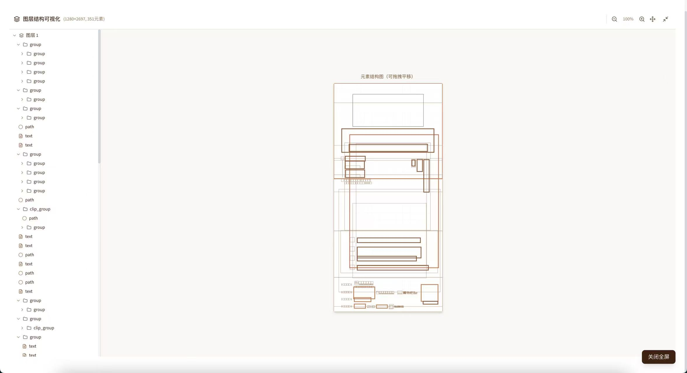

<div align="center">

# 🎨 Illustrator Structure Parser

**A comprehensive toolkit for parsing Adobe Illustrator documents into structured data with AI-powered semantic analysis**

[](https://opensource.org/licenses/MIT)
[](https://www.adobe.com/products/illustrator.html)
[](https://reactjs.org/)
[](https://www.typescriptlang.org/)
[](https://www.python.org/)

[Features](#-features) • [Quick Start](#-quick-start) • [Web App](#-web-application) • [ML Service](#-ml-service) • [API](#-api-reference) • [Contributing](#-contributing)

<br>

### 📸 Screenshots

| Upload Interface | Results Dashboard |
|:----------------:|:-----------------:|
|  |  |

| Variable Selector | Layer Structure |
|:-----------------:|:---------------:|
|  |  |

| Batch Generator | Illustrator Script |
|:---------------:|:------------------:|
|  |  |

</div>

---

## ✨ Features

### 🔍 Core Parsing Engine (ExtendScript)
- **Stable UUID Generation** — Content-based hashing ensures consistent IDs across multiple parses
- **Coordinate System Normalization** — Supports `top-left`, `bottom-left`, and `center` origins
- **Full Transform Matrix Extraction** — Rotation, scale, and skew values parsed from matrices
- **Multi-style Text Support** — Parse different fonts/colors within a single text frame
- **Complete Color Information** — RGB, CMYK, HSL, Hex, and gradient color stops
- **40+ Semantic Rules** — Auto-detect names, dates, titles, contact info, and more
- **30+ Prefix Tags** — Smart classification of replaceable template elements

### 🔬 Leave-One-Out (LOO) Analysis
- Hide elements one-by-one and export images
- Compare against baseline to determine **true visual impact**
- Discover hidden clipping masks, blend modes, and indirect effects
- Generate impact scores and heatmaps

### 🌐 Enterprise Web Application
- **React 18 + TypeScript + Vite** frontend
- **Fastify + TypeScript** backend
- **Shadcn/UI** components with dark mode
- Drag & drop file upload with real-time progress
- Comprehensive results dashboard with analytics

### 🧠 ML Hierarchy Analysis Service
- **PyTorch + Graph Neural Networks** for layer relationship analysis
- FastAPI service with REST endpoints
- Visual feature extraction with CNN (MobileNetV3)
- 8 hierarchy roles + 12 structure patterns

---

## 📁 Project Structure

```
illustrator-structure-parser/
├── AI_Template_Parser_v3.jsx    # Main ExtendScript entry point
├── lib/                          # ExtendScript modules
│   ├── config.jsx               # Configuration (30+ prefix rules)
│   ├── utils.jsx                # Utilities (ID/coords/colors/logging)
│   ├── error_handler.jsx        # Error handling with recovery
│   ├── parsers.jsx              # Element parsers
│   ├── loo_analyzer.jsx         # Leave-One-Out analysis
│   ├── html_generator.jsx       # HTML/CSS code generation
│   ├── progress_ui.jsx          # Progress dialog UI
│   └── test_framework.jsx       # Built-in test framework
├── tools/
│   ├── loo_diff_analyzer.py     # Python pixel-diff analysis
│   └── ml_service/              # ML hierarchy analysis service
│       ├── server.py            # FastAPI server
│       ├── models/              # PyTorch models
│       └── training/            # Training scripts
├── web/                          # Enterprise web application
│   ├── client/                  # React frontend
│   └── server/                  # Fastify backend
└── output/                       # Export directory
```

---

## 🚀 Quick Start

### Prerequisites

- **Adobe Illustrator** CC 2020 or later
- **Node.js** 18+ (for web app)
- **Python** 3.9+ (for ML service and LOO analysis)

### Basic Usage (ExtendScript)

1. Open your document in Adobe Illustrator
2. Go to **File → Scripts → Other Script**
3. Select `AI_Template_Parser_v3.jsx`
4. Check the `output/` directory for results

### Configuration

Edit `lib/config.jsx` to customize behavior:

```javascript
var CONFIG = {
    projectPath: "/path/to/your/project/",
    
    parse: {
        includeHidden: false,      // Include hidden elements
        includeLocked: true,       // Include locked elements
        extractTextRanges: true,   // Multi-style text parsing
        generateStableIds: true    // Content-based UUIDs
    },
    
    coordinates: {
        origin: "top-left",        // Coordinate origin
        unit: "px"                 // Unit system
    },
    
    loo: {
        enabled: false,            // Enable LOO analysis
        sampleMode: "important"    // "all" | "random" | "important"
    },
    
    html: {
        enabled: true,             // Enable HTML/CSS generation
        positioning: "absolute",   // Layout mode
        exportSeparateFiles: true  // Separate HTML/CSS files
    }
};
```

---

## 🔬 Leave-One-Out Analysis

LOO analysis reveals the **true visual impact** of each element by systematically hiding them and comparing exports.

### Enable LOO Analysis

```javascript
// In lib/config.jsx
loo: {
    enabled: true,
    sampleMode: "important"  // Focus on high-importance elements
}
```

### Run Pixel-Diff Analysis

```bash
cd tools
pip install pillow numpy opencv-python scikit-image

python loo_diff_analyzer.py \
    ../output/loo_exports/baseline.png \
    ../output/loo_exports/ \
    -o ../output/loo_report.json
```

---

## 🌐 Web Application

A full-featured enterprise web interface for document parsing and analysis.

### Tech Stack

| Layer | Technology |
|-------|------------|
| Frontend | React 18, TypeScript, Vite, Tailwind CSS |
| UI Components | Shadcn/UI, Radix UI, Lucide Icons |
| Backend | Fastify, TypeScript |
| Theme | Dark mode (default), Glassmorphism design |

### Installation & Running

```bash
cd web

# Install dependencies
cd server && npm install && cd ..
cd client && npm install && cd ..

# Development mode
./start.sh

# Or run separately:
# Terminal 1: cd server && npm run dev
# Terminal 2: cd client && npm run dev
```

**Access Points:**
- Development: http://localhost:3000 (client) → http://localhost:8080 (API)
- Production: http://localhost:8080

---

## 🧠 ML Service

Deep learning service for hierarchy analysis using Graph Neural Networks.

### Quick Start

```bash
cd tools/ml_service
pip install -r requirements.txt
python server.py
```

Service runs at `http://127.0.0.1:8765`

### API Endpoints

| Method | Endpoint | Description |
|--------|----------|-------------|
| POST | `/analyze` | Analyze document hierarchy |
| POST | `/convert` | Convert structure.json to graph |
| GET | `/hierarchy-roles` | Get role definitions |
| GET | `/health` | Health check |

### Hierarchy Roles

| ID | Role | Description |
|----|------|-------------|
| 0 | background | Background layer |
| 1 | decoration | Decorative elements |
| 2 | content_container | Content wrapper |
| 3 | content_primary | Main content |
| 4 | content_secondary | Secondary content |
| 5 | navigation | Navigation elements |
| 6 | branding | Brand elements |
| 7 | interactive | Interactive elements |

---

## 📄 Output Format

### structure.json

```json
{
  "meta": { "version": "3.0", "timestamp": "..." },
  "document": { "name": "...", "width": 1920, "height": 1080 },
  "layers": [...],
  "elements": [...],
  "tree": [...],
  "statistics": {...},
  "looAnalysis": {...}
}
```

### Element Object

```json
{
  "id": "text_a1b2c3d4",
  "type": "text",
  "category": "text",
  "importance": "high",
  "name": "Main Title",
  "position": { "x": 100, "y": 200 },
  "size": { "width": 300, "height": 50 },
  "content": "Creative Design Contest",
  "style": {
    "fontName": "SourceHanSansCN-Bold",
    "fontSize": 48,
    "fillColor": { "type": "RGBColor", "hex": "#FF5500" }
  },
  "semantics": {
    "hints": ["title"],
    "role": "heading",
    "replaceable": false,
    "confidence": 0.8
  },
  "transform": {
    "rotation": 0,
    "scale": { "x": 1, "y": 1 }
  }
}
```

---

## 🏷️ Prefix Tag System

Name elements in Illustrator with specific prefixes for automatic classification:

| Prefix | Type | Purpose | HTML Tag |
|--------|------|---------|----------|
| `txt_` | Text | Dynamic text | `<p>` |
| `title_` | Text | Title | `<h1>` |
| `subtitle_` | Text | Subtitle | `<h2>` |
| `name_` | Text | Person name | `<span>` |
| `date_` | Text | Date | `<time>` |
| `price_` | Text | Price | `<span>` |
| `img_` | Image | Dynamic image | `` |
| `photo_` | Image | Photo | `` |
| `avatar_` | Image | Avatar | `` |
| `logo_` | Brand | Logo | `` |
| `icon_` | Icon | Icon | `<i>` |
| `qr_` | QR Code | Dynamic QR | `` |
| `btn_` | Button | Interactive | `<button>` |
| `bg_` | Background | Decoration | `<div>` |
| `card_` | Container | Layout | `<div>` |

**Example:** Name a layer `txt_headline` or `img_product`

---

## 📊 API Reference

### Web Application API

| Method | Endpoint | Description |
|--------|----------|-------------|
| POST | `/api/upload` | Upload AI file |
| POST | `/api/process/:taskId` | Start parsing |
| GET | `/api/result/:taskId` | Get parsing result |
| GET | `/api/status/:taskId` | Check processing status |
| GET | `/api/health` | Health check |

---

## 🛡️ Robustness Features

### Error Handling
- **Error Levels:** FATAL / RECOVERABLE / WARNING / INFO
- **Recovery Strategies:** Custom error recovery logic
- **Boundary Checks:** Element count, recursion depth, text length limits
- **Safe Execution:** `ErrorHandler.safeExecute()` wrapper

### Timeout Control
- **Max Execution Time:** 5 minutes (configurable)
- **User Cancellable:** Cancel button in progress dialog
- **Timeout Callbacks:** Custom timeout handling

### Built-in Test Framework
- **Assertions:** assertEqual, assertTrue, assertContains, assertThrows
- **Validators:** validateElement, validateStructure, validateJson
- **Built-in Tests:** ID generator, color conversion, semantic analysis

---

## 📈 Version Comparison

| Feature | v2.0 | v3.0 |
|---------|------|------|
| ID Generation | Incremental (unstable) | Content hash (stable) |
| Coordinate System | AI native (Y-up) | Configurable (normalized) |
| Transform Matrix | Raw values | Parsed rotation/scale |
| Text Parsing | Single style | Multi-style ranges |
| Color Information | Basic | RGB/CMYK/HSL/Gradient |
| LOO Analysis | ❌ | ✅ Full support |
| Performance | Standard | Chunked + streaming |
| Prefix Tags | ❌ | 30+ types |
| HTML Generation | ❌ | ✅ Responsive |
| Error Handling | Basic try-catch | Full recovery strategies |
| Progress UI | ❌ | ✅ Visual dialog |
| Timeout Control | ❌ | ✅ Configurable |
| Test Framework | ❌ | ✅ Built-in |
| Semantic Rules | 8 | 40+ |

---

## 🤝 Contributing

Contributions are welcome! Please feel free to submit a Pull Request.

1. Fork the repository
2. Create your feature branch (`git checkout -b feature/AmazingFeature`)
3. Commit your changes (`git commit -m 'Add some AmazingFeature'`)
4. Push to the branch (`git push origin feature/AmazingFeature`)
5. Open a Pull Request

---

## 📚 References

This project was inspired by:
- [opendesigndev/illustrator-parser-pdfcpu](https://github.com/opendesigndev/illustrator-parser-pdfcpu) — PDF layer parsing
- [creold/illustrator-scripts](https://github.com/creold/illustrator-scripts) — ExtendScript best practices

---

## 📄 License

This project is licensed under the MIT License - see the [LICENSE](LICENSE) file for details.

---

<div align="center">

**Made with ❤️ for the design community**

[⬆ Back to Top](#-illustrator-structure-parser)

</div>
